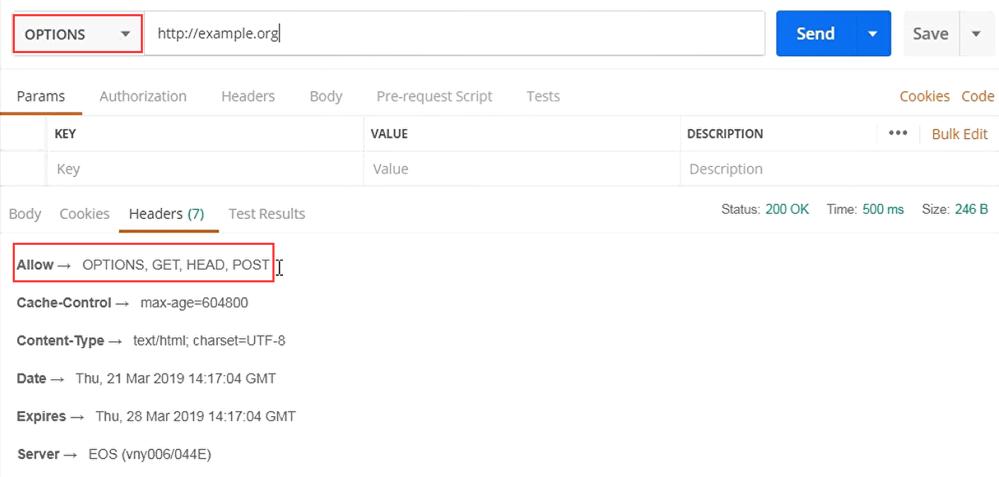
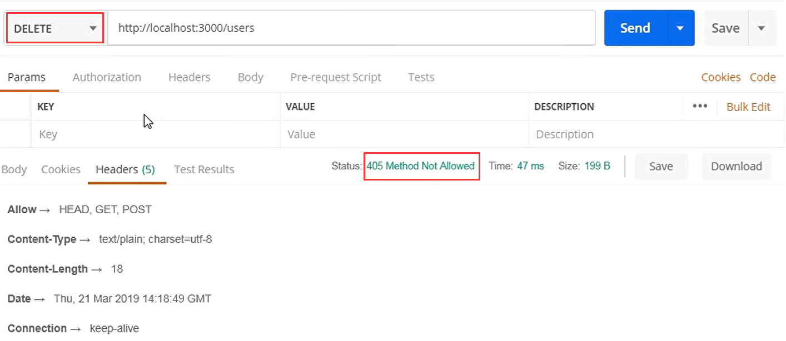
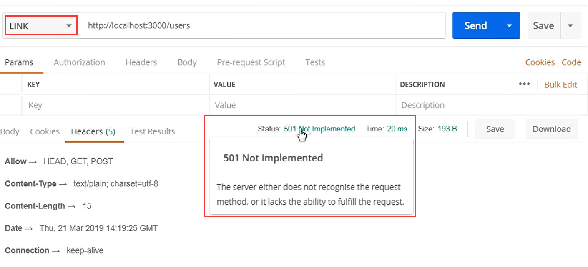

# Rest

## Rest是什么

是一种万维网软件架构**风格**
Representational State Transfer，简称REST
Representational：数据的表现形式（JSON、XML……）
State：当前状态或者数据
Transfer：数据传输

## REST的6个限制

- 客户-服务器(client-Server)
  - 关注点分析
  - 服务端专注数据存储，提升了简单性
  - 前端专注用户界面，提升了可移植性
- 无状态
  - 所有用户回话信息都保存在客户端
  - 每次请求必须包括所有信息，不能依赖上下文信息
  - 服务端不用保存会话信息，提升了简单性，可靠性，可见性
- 缓存
  - 所有服务端响应都要被标为可缓存或不可缓存
  - 减少前后端交互，提升了性能
- 统一接口（Uniform Interface）（核心）
  - 接口设计尽可能统一通用，提升了简单性、可见性
  - 接口与实现解耦，使前后端可以独立开发迭代
- 分层系统（Layered System）
  - 每层只知道相邻的一层，后面隐藏的就不知道了
  - 客户端不知道是和代理还是和真实服务器通信
  - 其他层：安全层、负载均衡、缓存等
- 按需代码（Code-On-Demand可选）
  - 客户端可以下载运行服务端传来的代码（比如JS）
  - 通过减少一些功能，简化了客户端

### 统一接口

- 资源的标识
  - 资源是任何可以命名的事物，比如用户、评论等
  - 每个资源可以通过URI被唯一地标识
- 通过表述来操作资源
  - 表述就是Representation，比如JSON、XML等
  - 客户端不能直接操作（比如SQL）服务端资源
  - 客户端应该通过表述（比如JSON）来操作资源
- 自描述消息
  - 每个消息（请求或响应）必须提供足够的信息让接受者理解
  - 媒体类型（application/json、application/xml）
  - HTTP方法：GET、POST、DELETE
  - 是否缓存
- 超媒体作为应用状态引擎
  - 超媒体：带文字的链接
  - 应用状态：一个网页
  - 引擎：驱动、跳转
  - 合起来：点击链接跳转到另一个网页

以github的API为例：[github API](https://developer.github.com/v3/#schema)

它的自描述信息，都是为json格式的：

```json
  curl -i https://api.github.com/users/octocat/orgs
  HTTP/1.1 200 OK
  Server: nginx
  Date: Fri, 12 Oct 2012 23:33:14 GMT
  Content-Type: application/json; charset=utf-8
  Connection: keep-alive
  Status: 200 OK
  ETag: "a00049ba79152d03380c34652f2cb612"
  X-GitHub-Media-Type: github.v3
  X-RateLimit-Limit: 5000
  X-RateLimit-Remaining: 4987
  X-RateLimit-Reset: 1350085394
  Content-Length: 5
  Cache-Control: max-age=0, private, must-revalidate
  X-Content-Type-Options: nosniff
```

HTTP verbs

|  Verb  |                                                                                                                                                 Description                                                                                                                                                  |
| :----: | :----------------------------------------------------------------------------------------------------------------------------------------------------------------------------------------------------------------------------------------------------------------------------------------------------------: |
|  HEAD  |                                                                                                                     Can be issued against any resource to get just the HTTP header info.                                                                                                                     |
|  GET   |                                                                                                                                        Used for retrieving resources.                                                                                                                                        |
|  POST  |                                                                                                                                         Used for creating resources.                                                                                                                                         |
| PATCH  | Used for updating resources with partial JSON data. For instance, an Issue resource has `title` and `body` attributes. A PATCH request may accept one or more of the attributes to update the resource. PATCH is a relatively new and uncommon HTTP verb, so resource endpoints also accept `POST` requests. |
|  PUT   |                                                                                Used for replacing resources or collections. For `PUT` requests with no `body` attribute, be sure to set the `Content-Length` header to zero.                                                                                 |
| DELETE |                                                                                                                                         Used for deleting resources.                                                                                                                                         |

## Restful API

### 请求设计规范

URI使用名词，尽量用复数，如 /users
URI使用名词使用嵌套表示关联关系，如/users/12/repos/
使用正确的HTTP方法，如GET/POST/PUT
不符合CRUD的情况：POST/action/子资源

### 响应设计规范

- 查询：`https://api.github.com/users?since=100`
- 分页：`https://api.github.com/users/repos?page=2&per_page=100`
- 字段过滤：`https://api.github.com/users/repos?field=name`
- 状态码：403、404
- 错误处理：[github 错误处理](`https://developer.github.com/v3/#client-errors`)

```json
HTTP/1.1 422 Unprocessable Entity
Content-Length: 149

{
  "message": "Validation Failed",
  "errors": [
    {
      "resource": "Issue",
      "field": "title",
      "code": "missing_field"
    }
  ]
}
```

### 安全

- https
- 鉴权：需要登录才能获取接口返回信息，jwt就是一种实现鉴权的方式  [github 鉴权](`https://developer.github.com/v3/#authentication`)
- 限流：预防攻击网站的人 [github 限流](`https://developer.github.com/v3/#rate-limiting`)

```json
  curl -i https://api.github.com/users/octocat
  HTTP/1.1 200 OK
  Date: Mon, 01 Jul 2013 17:27:06 GMT
  Status: 200 OK
  X-RateLimit-Limit: 60
  X-RateLimit-Remaining: 56
  X-RateLimit-Reset: 1372700873
```

### 开发者友好

- 文档
- 超媒体

### http options方法的作用是什么？

- 检测服务器所支持的请求方法

一个接口写了get和post方法，用户想知道这个接口支持哪些方法，就可以用options请求


- CORS中的预检请求
  查看该网站是否允许跨域请求

### KOA-router 中 allwoedMethods的作用

- 响应options方法，告诉它所支持的请求方法
- 相应地返回405（不允许）和501（没实现）

405 表示这个方法，我有能力实现，但是还没有实现

501 allwoedMethods，不认识link这种请求方法，没能力实现，所以还没有实现


### 错误处理

- 编程语言或计算机硬件里的一种机制
- 处理软件或信息系统中出现的异常状况
  - 异常状况
    - 运行时错误，返回500
    - 逻辑错误，找不到(404),先决条件失败(412),无法处理的实体(参数格式不对，422)等
  
为什么要用错误处理：

- 防止程序挂掉
- 告诉用户错误信息
- 便于开发者调试

