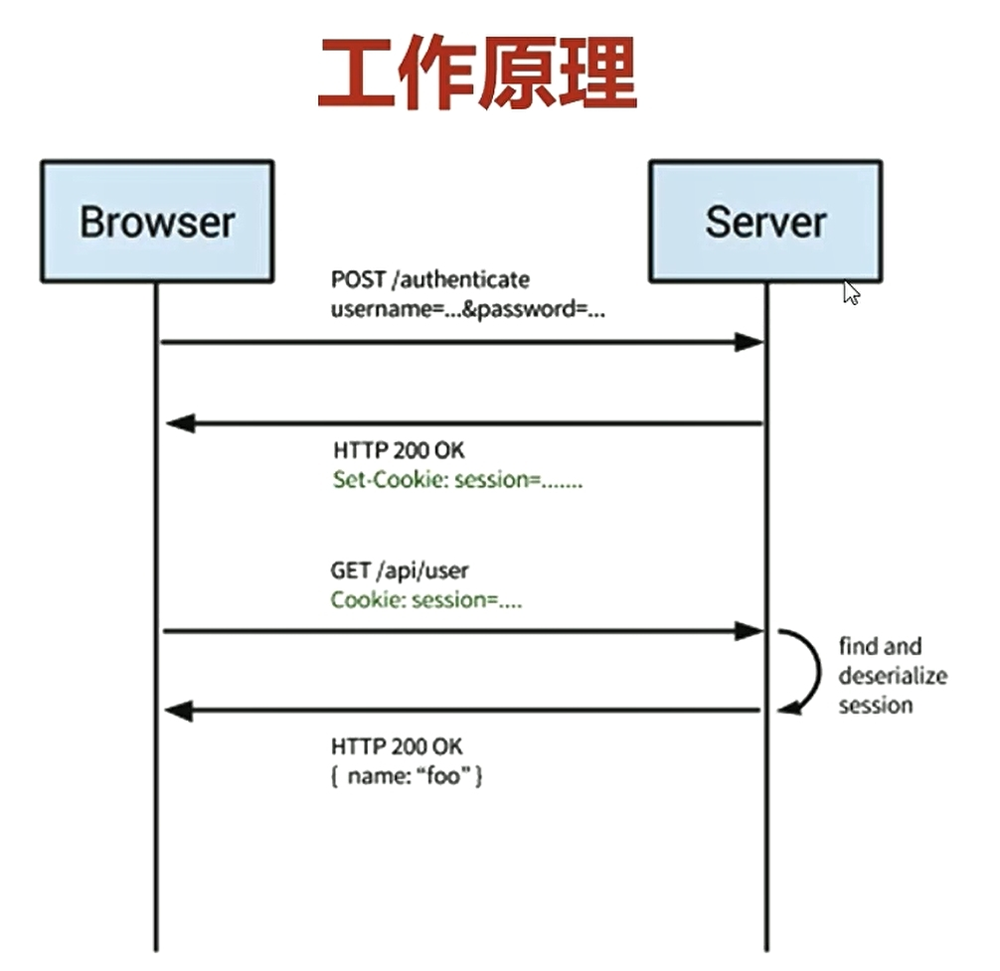
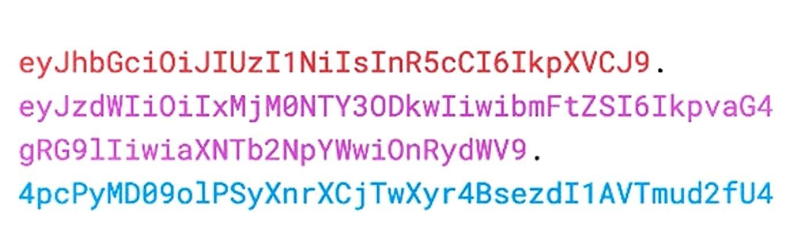
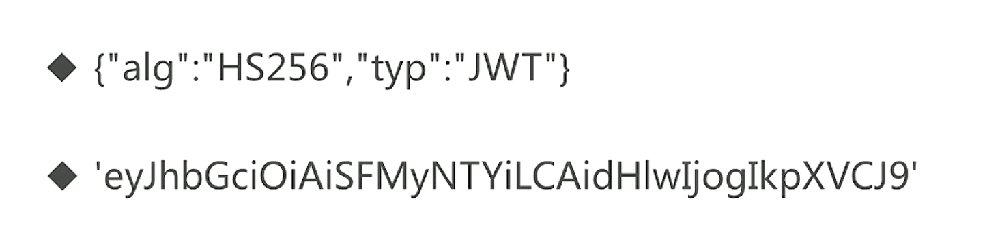
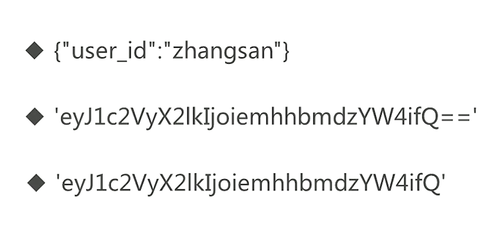
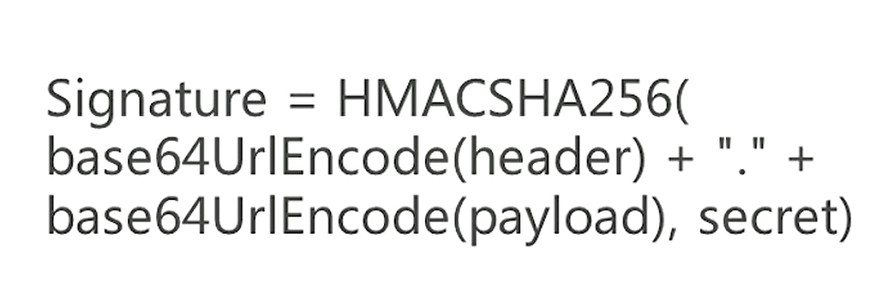
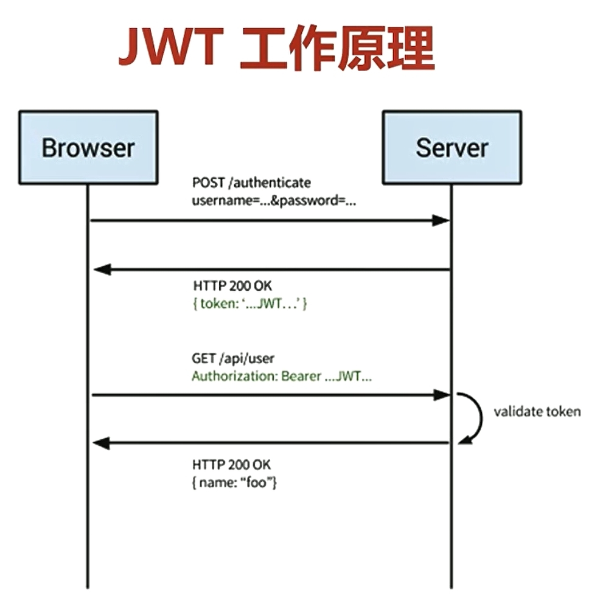

# Rest

## Rest是什么

是一种万维网软件架构**风格**
Representational State Transfer，简称REST
Representational：数据的表现形式（JSON、XML……）
State：当前状态或者数据
Transfer：数据传输

## REST的6个限制

- 客户-服务器(client-Server)
  - 关注点分析
  - 服务端专注数据存储，提升了简单性
  - 前端专注用户界面，提升了可移植性
- 无状态
  - 所有用户回话信息都保存在客户端
  - 每次请求必须包括所有信息，不能依赖上下文信息
  - 服务端不用保存会话信息，提升了简单性，可靠性，可见性
- 缓存
  - 所有服务端响应都要被标为可缓存或不可缓存
  - 减少前后端交互，提升了性能
- 统一接口（Uniform Interface）（核心）
  - 接口设计尽可能统一通用，提升了简单性、可见性
  - 接口与实现解耦，使前后端可以独立开发迭代
- 分层系统（Layered System）
  - 每层只知道相邻的一层，后面隐藏的就不知道了
  - 客户端不知道是和代理还是和真实服务器通信
  - 其他层：安全层、负载均衡、缓存等
- 按需代码（Code-On-Demand可选）
  - 客户端可以下载运行服务端传来的代码（比如JS）
  - 通过减少一些功能，简化了客户端

### 统一接口

- 资源的标识
  - 资源是任何可以命名的事物，比如用户、评论等
  - 每个资源可以通过URI被唯一地标识
- 通过表述来操作资源
  - 表述就是Representation，比如JSON、XML等
  - 客户端不能直接操作（比如SQL）服务端资源
  - 客户端应该通过表述（比如JSON）来操作资源
- 自描述消息
  - 每个消息（请求或响应）必须提供足够的信息让接受者理解
  - 媒体类型（application/json、application/xml）
  - HTTP方法：GET、POST、DELETE
  - 是否缓存
- 超媒体作为应用状态引擎
  - 超媒体：带文字的链接
  - 应用状态：一个网页
  - 引擎：驱动、跳转
  - 合起来：点击链接跳转到另一个网页

以github的API为例：[github API](https://developer.github.com/v3/#schema)

它的自描述信息，都是为json格式的：

```json
  curl -i https://api.github.com/users/octocat/orgs
  HTTP/1.1 200 OK
  Server: nginx
  Date: Fri, 12 Oct 2012 23:33:14 GMT
  Content-Type: application/json; charset=utf-8
  Connection: keep-alive
  Status: 200 OK
  ETag: "a00049ba79152d03380c34652f2cb612"
  X-GitHub-Media-Type: github.v3
  X-RateLimit-Limit: 5000
  X-RateLimit-Remaining: 4987
  X-RateLimit-Reset: 1350085394
  Content-Length: 5
  Cache-Control: max-age=0, private, must-revalidate
  X-Content-Type-Options: nosniff
```

HTTP verbs

|  Verb  |                                                                                                                                                 Description                                                                                                                                                  |
| :----: | :----------------------------------------------------------------------------------------------------------------------------------------------------------------------------------------------------------------------------------------------------------------------------------------------------------: |
|  HEAD  |                                                                                                                     Can be issued against any resource to get just the HTTP header info.                                                                                                                     |
|  GET   |                                                                                                                                        Used for retrieving resources.                                                                                                                                        |
|  POST  |                                                                                                                                         Used for creating resources.                                                                                                                                         |
| PATCH  | Used for updating resources with partial JSON data. For instance, an Issue resource has `title` and `body` attributes. A PATCH request may accept one or more of the attributes to update the resource. PATCH is a relatively new and uncommon HTTP verb, so resource endpoints also accept `POST` requests. |
|  PUT   |                                                                                Used for replacing resources or collections. For `PUT` requests with no `body` attribute, be sure to set the `Content-Length` header to zero.                                                                                 |
| DELETE |                                                                                                                                         Used for deleting resources.                                                                                                                                         |

## Restful API

### 请求设计规范

URI使用名词，尽量用复数，如 /users
URI使用名词使用嵌套表示关联关系，如/users/12/repos/
使用正确的HTTP方法，如GET/POST/PUT
不符合CRUD的情况：POST/action/子资源

### 响应设计规范

- 查询：`https://api.github.com/users?since=100`
- 分页：`https://api.github.com/users/repos?page=2&per_page=100`
- 字段过滤：`https://api.github.com/users/repos?field=name`
- 状态码：403、404
- 错误处理：[github 错误处理](`https://developer.github.com/v3/#client-errors`)

```json
HTTP/1.1 422 Unprocessable Entity
Content-Length: 149

{
  "message": "Validation Failed",
  "errors": [
    {
      "resource": "Issue",
      "field": "title",
      "code": "missing_field"
    }
  ]
}
```

### 安全

- https
- 鉴权：需要登录才能获取接口返回信息，jwt就是一种实现鉴权的方式  [github 鉴权](`https://developer.github.com/v3/#authentication`)
- 限流：预防攻击网站的人 [github 限流](`https://developer.github.com/v3/#rate-limiting`)

```json
  curl -i https://api.github.com/users/octocat
  HTTP/1.1 200 OK
  Date: Mon, 01 Jul 2013 17:27:06 GMT
  Status: 200 OK
  X-RateLimit-Limit: 60
  X-RateLimit-Remaining: 56
  X-RateLimit-Reset: 1372700873
```

### 开发者友好

- 文档
- 超媒体

### http options方法的作用是什么？

- 检测服务器所支持的请求方法

一个接口写了get和post方法，用户想知道这个接口支持哪些方法，就可以用options请求


- CORS中的预检请求
  查看该网站是否允许跨域请求

### KOA-router 中 allwoedMethods的作用

- 响应options方法，告诉它所支持的请求方法
- 相应地返回405（不允许）和501（没实现）

405 表示这个方法，我有能力实现，但是还没有实现

501 allwoedMethods，不认识link这种请求方法，没能力实现，所以还没有实现


### 错误处理

- 编程语言或计算机硬件里的一种机制
- 处理软件或信息系统中出现的异常状况
  - 异常状况
    - 运行时错误，返回500
    - 逻辑错误，找不到(404),先决条件失败(412),无法处理的实体(参数格式不对，422)等
  
为什么要用错误处理：

- 防止程序挂掉
- 告诉用户错误信息
- 便于开发者调

## NoSQL

对于不同于传统的关系型数据库的数据库管理系统的统称

###　分类

- 列存储（HBase）
- 文档存储（MongoDB）
- Key-value（Redis）
- 图存储（FlockDB）
- 对象存储（db4o）
- XML存储（BaseX）

### 为什么要用NoSQL

- 简单
- 便于横向拓展
- 适合超大规模数据的存储
- 很灵活地存储复杂结构的数据（Schema Free）

关系型数据库最典型的数据结构是表，由二维表及其之间的联系所组成的一个数据组织
优点：
1、易于维护：都是使用表结构，格式一致；
2、使用方便：SQL语言通用，可用于复杂查询；
3、复杂操作：支持SQL，可用于一个表以及多个表之间非常复杂的查询。
缺点：
1、读写性能比较差，尤其是海量数据的高效率读写；
2、固定的表结构，灵活度稍欠；
3、高并发读写需求，传统关系型数据库来说，硬盘I/O是一个很大的瓶颈。


非关系型数据库严格上不是一种数据库，应该是一种数据结构化存储方法的集合，可以是文档或者键值对等。
优点：
1、格式灵活：存储数据的格式可以是key,value形式、文档形式、图片形式等等，文档形式、图片形式等等，使用灵活，应用场景广泛，而关系型数据库则只支持基础类型。
2、速度快：nosql可以使用硬盘或者随机存储器作为载体，而关系型数据库只能使用硬盘；
3、高扩展性；
4、成本低：nosql数据库部署简单，基本都是开源软件。

缺点：
1、不提供sql支持，学习和使用成本较高；
2、无事务处理；
3、数据结构相对复杂，复杂查询方面稍欠。

## Session

### 相关概念

- session：主要保存在服务器端，相对安全
- cookie：主要存放在客户端，并且不是很安全
- sessionStorage：仅在当前会话下有效，关闭页面活浏览器后被清除
- localstorage：除非被清除，否则永久保存

### 工作原理

- 浏览器将用户名和密码发送到服务端
- 服务端返回session
- 浏览器将session存储到cookie中，并将其再次返回到服务器
- 服务端将请求的数据返回给客户端



### Session的优势

- 相比JWT，最大的优势就在于可以主动清除session
- session保存在服务器端，相对较为安全
- 结合cookie使用，较为灵活，兼容性较好

### Session的劣势

- cookie+session 在跨域场景表现并不好
- 如果是分布式部署，需要做多机共享session机制
- 基于cookie的机制很容易被CSRF
- 查询session信息可能会有数据库查询操作

### cookie的属性

　一般cookie所具有的属性，包括：

　**Domain**：域，标识当前cookie所属于哪个域或子域下面。

　　对于服务器返回的Set-Cookie中，如果没有指定Domain的值，那么其Domain的值是默认为当前所提交的http的请求所对应的主域名的。比如访问

`http://www.example.com`，返回一个cookie，没有指明domain值，那么其值默认为`www.example.com`。

　**Path**：表示cookie的所属路径。

　**Expire time/Max-age**：表示了cookie的有效期。

　expire的值，是一个时间，过了这个时间，该cookie就失效了。或者是用max-age指定当前cookie是在多长时间之后而失效。如果服务器返回的一个cookie，没有指定其expire time，那么表明此cookie有效期只是当前的session，即是session cookie，当前session会话结束后，就过期了。对应的，当关闭（浏览器中）该页面的时候，此cookie就应该被浏览器所删除了。

　**secure**：表示该cookie只能用https传输。一般用于包含认证信息的cookie，要求传输此cookie的时候，必须用https传输。

　**httponly**：表示此cookie必须用于http或https传输。这意味着，浏览器脚本，比如JavaScript中，是不允许访问操作此cookie的。

## JWT

- JSON Web Token 是一个开放标准（RFC 7519）
- 定义了一种紧凑且独立的方式，可以将各方之间的信息作为JSON对象进行了安全传输
- 该信息可以验证和信任，因为是进过数字签名的

补充：
请求意见稿（英语：Request for Comments，缩写：RFC）是由互联网工程任务组（IETF）发布的一系列备忘录。文件收集了有关互联网相关信息，以及UNIX和互联网社群的软件文件，以编号排定。当前RFC文件是由互联网协会（ISOC）赞助发行。

RFC始于1969年，由当时就读加州大学洛杉矶分校（UCLA）的斯蒂芬·克罗克（Stephen D. Crocker）用来记录有关ARPANET开发的非正式文档，他是第一份RFC文档的撰写者。最终演变为用来记录互联网规范、协议、过程等的标准文件。基本的互联网通信协议都有在RFC文件内详细说明。RFC文件还额外加入许多的论题在标准内，例如对于互联网新开发的协议及发展中所有的记录。 —— [RFC维基百科](`https://zh.wikipedia.org/wiki/RFC`)

### JWT的构成

- 头部（Header）
- 有效载荷（Payload）
- 签名（Signature）



#### Header

- typ：token的类型，这里固定为JWT
- alg：使用的hash算法，例如：HMAC SHA256或者RSA

我们看到的，不是一个json，是因为我们看到的是base64编码之后的结果

Header 编码前后的结果


#### Payload

- 存储需要传递的信息，如用户ID、用户名等
- 还包含元数据，如过期时间，发布人等
- 与Header不同，Payload可以加密，不仅仅只是base64编码

Payload 编码前后的结果
第一个是base64编码后的结果
第二个是base64url编码后的结果



#### Signature

- 对Header和Payload部分进行签名
- 保证Token在传输的过程中没有被篡改或者破坏
  
Signature 编码


### JWT工作原理



## JWT vs. Session

